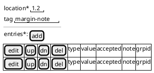
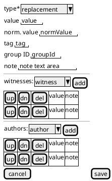

# Apparatus

Data from scan:

- [XML tree](mqdq-app-report.html)
- [characters counts](mqdq-app-chars.tsv)

## Model

The apparatus model is designed to meet the requirements of MQDQ and at the same time be general enough to apply to other projects as well.

The apparatus fragment, i.e. an entry in the apparatus metatextual layer, is modeled as follows:

- `location`: the fragment location.
- `tag`: an optional arbitrary string representing a categorization of some sort for that fragment, e.g. "margin", "interlinear", etc. This can be overridden by variants `tag`.

- `entries`: 1 or more variants/notes, each with these properties:

  - `type`: an enumerated constant to be chosen among replacement (0), addition before (1), addition after (2), note (3).
  - `value`: the variant's value. May be zero (empty or null) for deletions. Is optional (because not used) when `type` is note.
  - `tag`: an optional arbitrary string representing a categorization of some sort for that fragment, e.g. "margin", "interlinear", etc. It overrides the fragment's `tag`.
  - `normValue`: an optional normalized form derived from `value`.
  - `note`: an optional annotation. When `type` is note, `value` has no meaning and this property contains the note's text. Else, this can be an additional note side to side with the variant's value.
  - `authors`: optional array of annotated sources. Each has a `value` and an optional `note`.
  - `witnesses`: optional array of annotated sources, as above.
  - `isAccepted`: boolean, true if the variant represents the accepted text (=lemma).
  - `groupId`: an optional arbitrary ID to be used for grouping fragments in the layer together.

If required, notes can be Markdown to include some minimal formatting. We should limit ourselves to very basic formatting, e.g. italic and bold.

## Mapping to Model

This section discusses the mapping between the above apparatus model and its MQDQ representation in terms of the XML DOM.

Each `app` element corresponds to a **fragment**. Its mapping is as follows:

- `app/@from @to`: `location`. The location is recalculated according to the Cadmus coordinates system and the corresponding base text. The original location for export will be retrieved from the metadata of the base text tiles.
- `app/@loc`: `location`. In this case the value of the `loc` attribute contains 2 or more IDs representing a non-continuous range. This is modeled into Cadmus as distinct entries, all belonging to the same group. Thus, in this case we will map a fragment for each single location in loc.
- `app/@type`: copied in `tag` as it is. This way we will be able to export it back.

As for **variants**:

- `app/lem` is the accepted variant, i.e. it is modeled like any other variants, with the only difference that its accepted property is true.
- `app/rdg*`: 0 or more readings, each mapped to a variant.

In both cases, their subtree is mapped as follows (in what follows I represent `lem` or `rdg` with the generic `P`=parent name):

- `app/P/@type`: copy into `tag` as it is. TODO: type=ancient-note
- `app/P/rdg/` text value: the unique child text node of `rdg` is its `value`. I assume there is only 1 such child text node.

- `app/P/rdg/ident/`: its text value is the `normValue`. Usually there is just a 1:1 relationship with the lemma. Yet, in some cases it may happen that a different number of words are involved; for instance, when 2 words correspond to a single word. In this case, these 2 words will have the same ID in their `n` attribute. TODO: details and example

- `app/P/@wit`: witnesses. Split at space and store in `witnesses`, removing the `#` prefix.
- `app/P/@source`: sources. Split at space and store in `authors`, removing the `#` prefix.

- `app/P/add @type=abstract`: `note` section 1.
- `app/P/note @type=operation`: `note` section 2.
- `app/P/note @type=details`: `note` section 3.
- `app/P/add @type=intertext`: `note` section 4.

The target of a note is specified by its `target` attribute. TODO: notes without target are possible?

Here `note` is a unique string where a divider character (can we use `|`??) is used to end each section. Thus, `one || two | three` means that section 1 = `one`, section 2 is not present, section 3 = `two`, section 4 = `three`.

Note values are trimmed, assuming that (??) we must add a whitespace before any after-value, or after any before-value.

Any of the note elements (`add`/`note`) can have mixed content where the only allowed child element is `emph` representing formatting. Its formatting is mapped from `@style` as follows:

- `font-style:italic`: italic. This text is wrapped in `_` (Markdown; I suggest `_` rather than `*` as I suppose the asterisk might happen to occur in its proper value).
- `font-weight:bold`: bold. This text is wrapped in `__` (Markdown, as above).

I assume that (??):

- no other styles are present.
- no other child element is present in `note`.

As for these properties, they are not directly mapped but calculated:

- `type`: TODO: type

## Samples

The following samples are extracted from real documents, and eventually reduced for clarity.

### Vergilius ecl. 1,2

`VERG-eclo` (1,2):

- apparatus with lemma and variant.
- notes to authors.
- ancient note.

```xml
<app from="#d001w9" to="#d001w9">
    <!-- lemma -->
    <lem wit="#lw1-16 #lw1-21">siluestrem</lem>
    <!-- variant -->
    <rdg source="#lb1-50 #lb1-25">agrestem
        <note type="details" target="#lb1-50"> 9, 4, 85,</note>
        <note type="details" target="#lb1-25"> SI 244</note>
        <ident n="d001w9">AGRESTEM</ident>
    </rdg>
    <!-- ancient note -->
    <rdg source="#lb1-56" type="ancient-note">
        <add type="abstract"><emph style="font-style:italic">silvestrem</emph>, agrestem<emph style="font-style:italic">.</emph></add>
    </rdg>
</app>
```

Model:

```json
{
  "location": "2.1",
  "entries": [
    {
      "type": 0,
      "isAccepted": true,
      "value": "siluestrem",
      "witnesses": [{ "value": "lw1-16" }, { "value": "lw1-21" }]
    },
    {
      "type": 0,
      "value": "agrestem",
      "normValue": "AGRESTEM",
      "authors": [
        { "value": "lb1-50", "note": "||9, 4, 85," },
        { "value": "lb1-50", "note": "||SI 244" }
      ]
    }
  ]
}
```

Notes:

- note values are trimmed and prepended by the required number of pipes to represent their section.
- ancient note is not in apparatus. As it belongs to a different domain, it should be placed on a different layer. Usually the ancient note would have more text and eventually its context. Here instead we just have variants in no particular context.

## User Interface

If you are not seeing these mockups, please use a Plantuml-enabled editor extension (VSCode has it), or just copy and paste the plantuml code [here](https://plantuml.com/index).

General tab:



All the variants/notes are listed at the bottom. You can add a new variant/note, or edit, move, or delete an existing one. When editing/adding a variant/note, you are taken to the variant tab:



Here you edit all the entries properties and click `save` (or `cancel` if you don't want to save changes) to go back to the entries list in the general tab.
